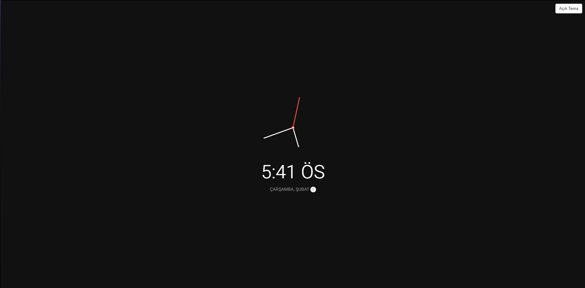
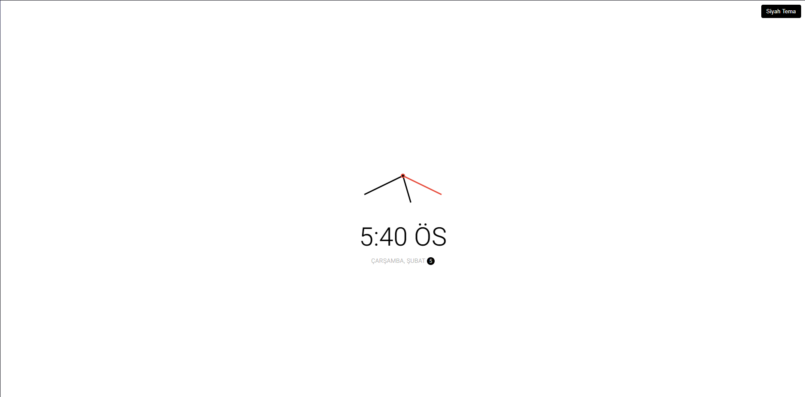

# Tema Ayarlı Analog Saat
Bu proje, kullanıcıların seçebileceği farklı tema seçenekleri sunan ve tarayıcı üzerinde çalışan analog bir saat uygulamasıdır. Uygulama, modern web teknolojilerini kullanarak responsive ve şık bir arayüz sunar.

## Özellikler
- **Analog Saat:** Gerçek zamanlı çalışan şık bir saat arayüzü.
- **Tema Desteği:** Kullanıcıların tercihlerine göre açık ve koyu tema seçenekleri.
- **Responsive Tasarım:** Tüm cihaz boyutlarına uyumlu.
- **Dinamik Güncelleme:** Saat, dakika ve saniye ibreleri dinamik olarak güncellenir.

## Kullanılan Teknolojiler
- HTML5
- CSS3
- JavaScript (Vanilla)

## Kurulum
Projeyi yerel ortamınıza indirmek ve çalıştırmak için aşağıdaki adımları izleyin:

```bash
# Depoyu klonlayın
git clone [https://github.com/kullanici_adi/tema-analog-saat.git](https://github.com/SelimKse/Temali-Analog-Saat.git)

# Proje dizinine gidin
cd tema-analog-saat
```

## Kullanım
Projeyi çalıştırmak için sadece tarayıcınızda `index.html` dosyasını açmanız yeterlidir.

### Tema Seçimi
- Sağ üst köşedeki tema butonuna tıklayarak temayı değiştirebilirsiniz.
- Seçilen tema tercihi tarayıcıda kaydedilir ve bir sonraki ziyaretinizde hatırlanır.

## Ekran Görüntüleri
### Koyu Tema


### Açık Tema


## Katkıda Bulunma
Katkıda bulunmak isterseniz aşağıdaki adımları izleyin:

1. Bu projeyi forklayın.
2. Yeni bir özellik dalı oluşturun: `git checkout -b yeni-ozellik`
3. Değişikliklerinizi commitleyin: `git commit -m 'Yeni özelliği ekle'`
4. Dalınızı gönderin: `git push origin yeni-ozellik`
5. Bir Pull Request oluşturun.

## Lisans
Bu proje MIT Lisansı ile lisanslanmıştır. Daha fazla bilgi için `LICENSE` dosyasına göz atabilirsiniz.
